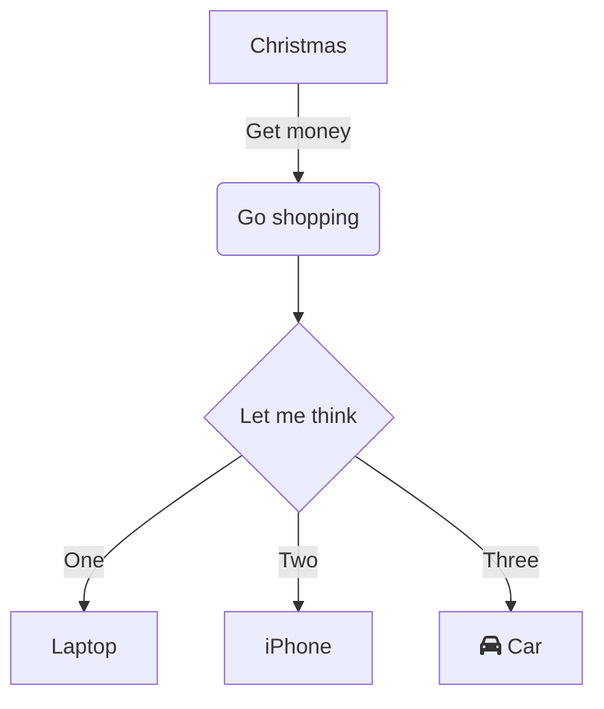
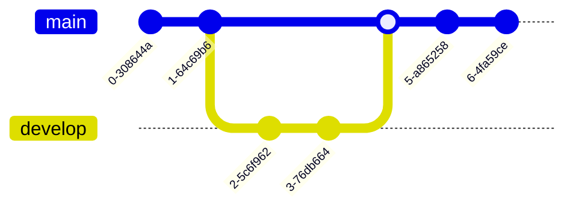
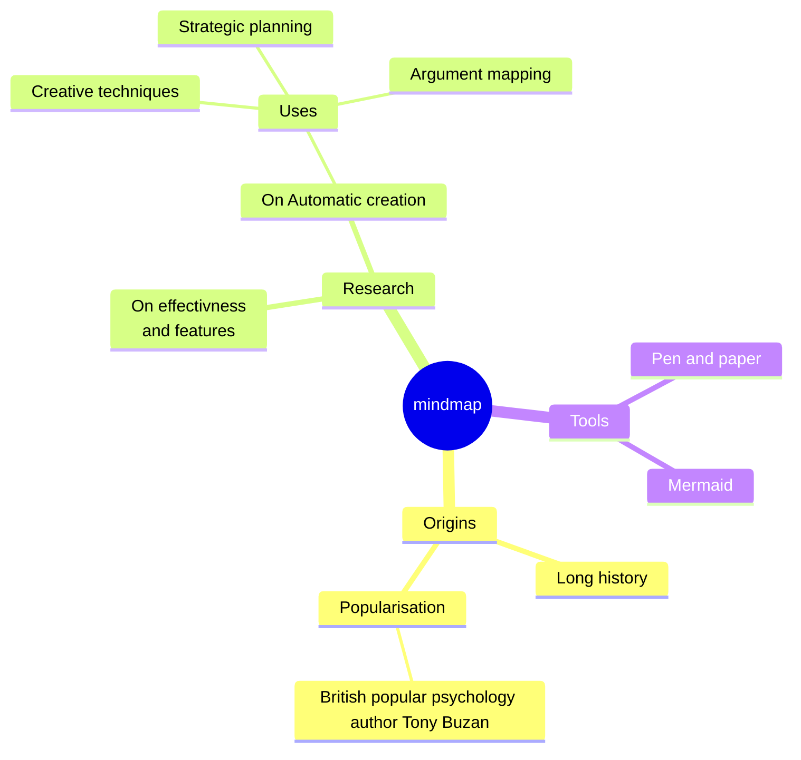

--- yaml
title: Features
createdAt: 2023-03-12T21:29:19.581Z
index: 1
category: roadmap
tags: []
authors: []
url: features
description: All Writeme features
id: features
---
<TableOfContent />

# Common Markdown

All basic features available in Markdown.

## Basic

- [I'm a link](https://github.com/g4rcez "My repository")
- **I'm a bold text**
- _I'm a italic text_
- **_Bold + Italic_**
- ~~Strike~~
- `Inline code`

## Horizontal line

Try

---

This

## Ordered list

1. List
2. With
3. Numbers

## To-Do List

You can create a simple [todo list](https://en.wikipedia.org/wiki/Wikipedia:To-do_list#:~:text=This%20is%20an%20information%20page.&text=It%20may%20reflect%20varying%20levels,%7B%7BTo%20do%7D%7D%20template. "Wikipedia link for to-do list")

- [ ] Task pending
- [x] Task completed

## Blockquote

You can use `> ` to quote someone

{/* https://www.goodreads.com/author/quotes/9810.Albert_Einstein */}

> Life is like riding a bicycle. To keep your balance, you must keep moving - Albert Eistein

## Images


Simple image, without title


Image using [html title](https://www.w3schools.com/tags/tag_title.asp)

[](https://via.placeholder.com/)
Image using link

# Extended syntax

Advanced features of markdown, using extended syntax + [Github Flavored Markdown](https://github.github.com/gfm/ "GFM Spec")

## Tables

| Syntax      | Description |
| ----------- | ----------- |
| Header      | Title       |
| Paragraph   | Text        |

# Footnotes

Here's a simple footnote[^1]. Click and go to the definition.

[^1]: This is the first footnote.

# Emojis :smile:

Support emojis using [remark-gemoji](https://github.com/remarkjs/remark-gemoji). You can view
the [Emoji CheatSheet](https://www.webfx.com/tools/emoji-cheat-sheet/) or in [Emojipedia](https://emojipedia.org/ "Emojipedia link"). Note: **not all emojis are supported**

:smile: :laughing: :blush: :smiley: :smirk: :heart_eyes: :kissing_heart: :kissing_closed_eyes: :flushed: :relieved: :grin: :wink: :stuck_out_tongue_winking_eye: :stuck_out_tongue_closed_eyes: :alien: :virgo: :ghost:

There's no place like :house:

# MDX

- Javascript expressions: `{6 * Math.PI}` === {6 * Math.PI}
- [Comments](https://reactjs.org/docs/faq-build.html#how-can-i-write-comments-in-jsx) like in a React app

## Tabs

Support tabs with [MDX](https://mdxjs.com/) or using comment with `{/* |tabs */}` to open and `{/* /tabs */}` to close. In comment mode, you
can pass the default tab after `|tabs`, just like this `{/* |tabs your-id */}`

{/* |tabs second */}

## First

This is first tab content

## Second

This is second tab content

{/* /tabs */}

## How Tab titles work?

Titles inside tabs comments aren't displayed in `<TableOfContent />` component. You can see the title of this section, because the title is out of `<Tabs/>` comments.

## Playground

Use [Sandpack](https://github.com/codesandbox/sandpack/ "Sandpack github page") playground to run Javascript/Typescrit code using your favorite [template](https://sandpack.codesandbox.io/docs/getting-started/custom-content#templates)

<Playground test="AA" />

# Http Request

Focus in web API docs, this component receive a `curl` or `http` command and transform in amazing HTTP Request visualizer. Create a code mark with bash language and pass `type=request` or just paste your code with `curl` or `http` at the beginning of the command.

````bash
```bash type=request
curl -X POST "{{host}}/api/test" -H "Content-Type: application/json" -d '{"email":"write@me.com"}'
```
````

Request to another domain

```bash type=request
curl -X GET "https://api.postmon.com.br/v1/cep/55641715" -H "Content-Type: application/json"
```

# Open Graph

Writeme can understand [Open Graph Protocol or OGP](https://ogp.me/) and show an amazing banner of link.

**Tested only for YouTube and GitHub for now**

Just paste the link of your YouTube video
```ogp
https://www.youtube.com/watch?v=EUJ5vWBT2iA
```

Or your GitHub repository

```ogp
https://github.com/github/training-kit
```

# Mermaid

Writeme supports all [mermaid](https://mermaid.js.org/) diagrams and charts. Examples from [Mermaid Live](https://mermaid.live/).

## Flowchart


## Git graph



## Mindmap

